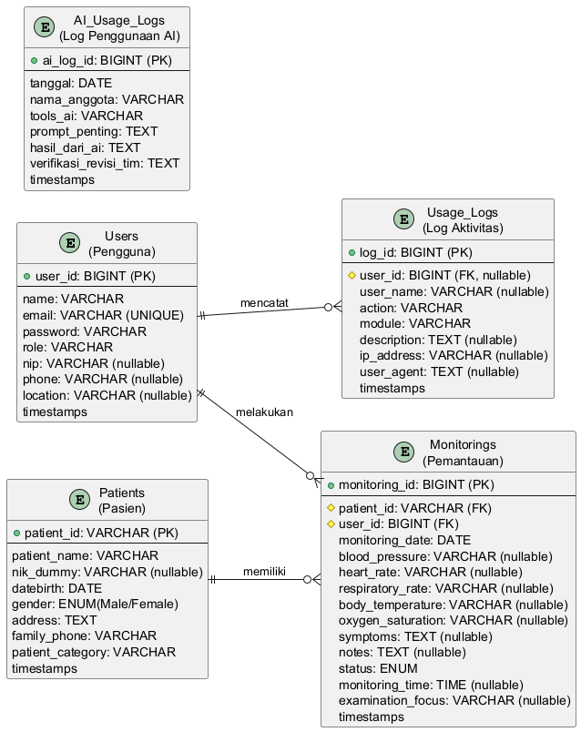

# Entity Relationship Diagram (ERD) — CareVisitMonitor

## Gambaran Umum

Sistem **CareVisitMonitor** memiliki **5 entitas**: `Users`, `Patients`, `Monitorings`, `Usage_Logs`, dan `AI_Usage_Logs`. Berikut adalah diagram ERD dan penjelasan relasi antar entitas.



---

## Daftar Entitas

### 1. Users (`users`)
| Kolom | Tipe Data | Keterangan |
|-------|-----------|------------|
| **id** (PK) | BIGINT, AUTO_INCREMENT | Primary Key |
| name | VARCHAR(255) | Nama pengguna |
| email | VARCHAR(255), UNIQUE | Email login |
| password | VARCHAR(255) | Password (hashed) |
| role | VARCHAR(255) | Role: `Petugas Kesehatan`, `Admin`, dll |
| nip | VARCHAR(255), nullable | Nomor Induk Pegawai |
| phone | VARCHAR(255), nullable | Nomor telepon |
| location | VARCHAR(255), nullable | Lokasi tugas |
| timestamps | DATETIME | created_at, updated_at |

### 2. Patients (`patients`)
| Kolom | Tipe Data | Keterangan |
|-------|-----------|------------|
| **patient_id** (PK) | VARCHAR(255) | Primary Key (manual ID) |
| patient_name | VARCHAR(255) | Nama pasien |
| nik_dummy | VARCHAR(255), nullable | NIK dummy |
| datebirth | DATE | Tanggal lahir |
| gender | ENUM('Male','Female') | Jenis kelamin |
| address | TEXT | Alamat |
| family_phone | VARCHAR(255) | Telepon keluarga |
| patient_category | VARCHAR(255) | Kategori pasien |
| timestamps | DATETIME | created_at, updated_at |

### 3. Monitorings (`monitorings`)
| Kolom | Tipe Data | Keterangan |
|-------|-----------|------------|
| **id** (PK) | BIGINT, AUTO_INCREMENT | Primary Key |
| **patient_id** (FK) | VARCHAR(255) | Foreign Key → patients.patient_id |
| **user_id** (FK) | BIGINT, UNSIGNED | Foreign Key → users.id |
| monitoring_date | DATE | Tanggal monitoring |
| blood_pressure | VARCHAR(255), nullable | Tekanan darah |
| heart_rate | VARCHAR(255), nullable | Denyut nadi |
| respiratory_rate | VARCHAR(255), nullable | Frekuensi nafas |
| body_temperature | VARCHAR(255), nullable | Suhu tubuh |
| oxygen_saturation | VARCHAR(255), nullable | Saturasi oksigen |
| symptoms | TEXT, nullable | Gejala |
| notes | TEXT, nullable | Catatan |
| status | ENUM('Stable','Need Control','Need Referral') | Status pasien |
| monitoring_time | TIME, nullable | Waktu monitoring |
| examination_focus | VARCHAR(255), nullable | Fokus pemeriksaan |
| timestamps | DATETIME | created_at, updated_at |

### 4. Usage_Logs (`usage_logs`)
| Kolom | Tipe Data | Keterangan |
|-------|-----------|------------|
| **id** (PK) | BIGINT, AUTO_INCREMENT | Primary Key |
| **user_id** (FK) | BIGINT, UNSIGNED, nullable | Foreign Key → users.id (ON DELETE SET NULL) |
| user_name | VARCHAR(255), nullable | Nama user (snapshot) |
| action | VARCHAR(100) | CREATE, READ, UPDATE, DELETE, LOGIN, LOGOUT |
| module | VARCHAR(100) | patients, monitorings, rekam-medis, auth |
| description | TEXT, nullable | Deskripsi aktivitas |
| ip_address | VARCHAR(45), nullable | Alamat IP pengguna |
| user_agent | TEXT, nullable | User agent browser |
| timestamps | DATETIME | created_at, updated_at |

### 5. AI_Usage_Logs (`ai_usage_logs`)
| Kolom | Tipe Data | Keterangan |
|-------|-----------|------------|
| **id** (PK) | BIGINT, AUTO_INCREMENT | Primary Key |
| tanggal | DATE | Tanggal penggunaan AI |
| nama_anggota | VARCHAR(255) | Nama anggota tim |
| tools_ai | VARCHAR(255) | Tools AI yang digunakan (ChatGPT, Copilot, dll) |
| prompt_penting | TEXT | Prompt yang diberikan |
| hasil_dari_ai | TEXT | Hasil/output dari AI |
| verifikasi_revisi_tim | TEXT | Verifikasi/revisi oleh tim |
| timestamps | DATETIME | created_at, updated_at |

---

## Relasi Antar Entitas

### 1. Users → Monitorings *(One to Many)*
```
User {1} ──────── {N} Monitoring
```
- **Relasi**: Seorang **user** (petugas kesehatan) dapat melakukan **banyak** monitoring.
- **Foreign Key**: `monitorings.user_id` → `users.id`
- **Di Model**:
  - `User.php` : `$this->hasMany(Monitoring::class, 'user_id')`
  - `Monitoring.php` : `$this->belongsTo(User::class)`

### 2. Users → Usage_Logs *(One to Many)*
```
User {1} ──────── {N} Usage_Log
```
- **Relasi**: Seorang **user** dapat memiliki **banyak** log aktivitas.
- **Foreign Key**: `usage_logs.user_id` → `users.id` (`nullOnDelete`)
- **Di Model**:
  - `UsageLog.php` : `$this->belongsTo(User::class)`
  - ⚠️ **Catatan**: Model `User` **belum** memiliki relasi `hasMany(UsageLog::class)`.

### 3. Patients → Monitorings *(One to Many)*
```
Patient {1} ──────── {N} Monitoring
```
- **Relasi**: Seorang **pasien** dapat memiliki **banyak** riwayat monitoring.
- **Foreign Key**: `monitorings.patient_id` → `patients.patient_id`
- **Di Model**:
  - `Patient.php` : `$this->hasMany(Monitoring::class, 'patient_id')`
  - `Monitoring.php` : `$this->belongsTo(Patient::class, 'patient_id', 'patient_id')`

### 4. AI_Usage_Logs *(Standalone)*
```
AI_Usage_Log {*} ─── (no relation) ─── *{Entity}
```
- Entitas ini **tidak memiliki relasi** dengan entitas lain. Berdiri sendiri sebagai catatan penggunaan tools AI oleh tim.

---

## Ringkasan Kardinalitas

| Relasi | From | To | Tipe |
|--------|------|----|------|
| User melakukan Monitoring | 1 User | N Monitoring | One-to-Many |
| User tercatat di Usage_Log | 1 User | N Usage_Log | One-to-Many |
| Patient memiliki Monitoring | 1 Patient | N Monitoring | One-to-Many |

---

## Catatan / Issues

1. **Missing inverse relation**: `User` belum memiliki method `usageLogs()` untuk mengakses log aktivitas dari sisi user.
2. **Missing foreign key constraints**: Migration `monitorings` tidak mendeklarasikan foreign key constraint untuk `patient_id` dan `user_id`.
3. **Patient PK**: Migration hanya menggunakan `->unique()` bukan `->primary()`, meskipun model mendeklarasikan `$primaryKey = 'patient_id'`.
4. **AI_Usage_Logs standalone**: Tidak terhubung ke entitas manapun — pastikan ini sesuai kebutuhan.
